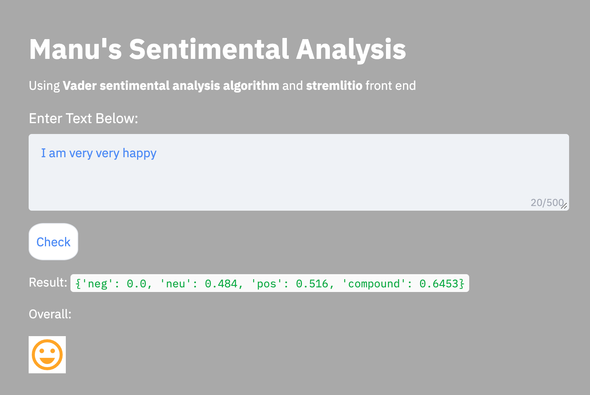
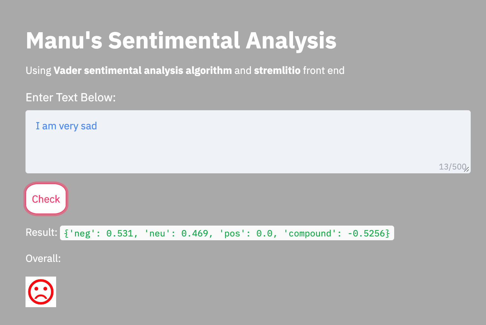
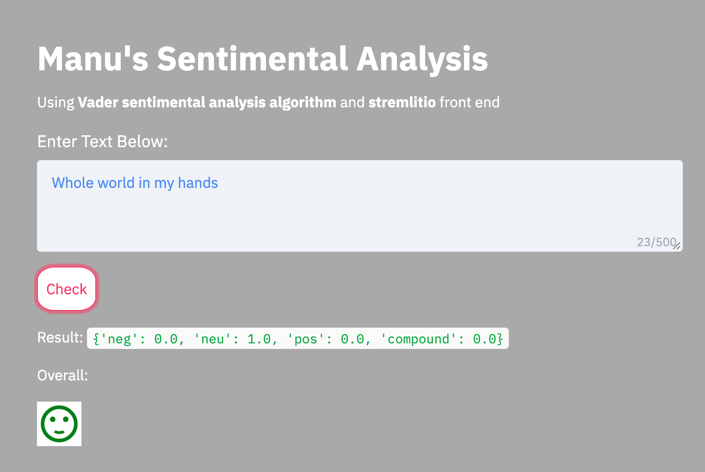

# Manu's Sentimental analysis.

Using Vader Sentiment Algorithm and Streamlitio app framework.

## Package Content

- ***nlpfeel.py***: Main python file that does everything. 

    - ***streamlitio***: This package facilitates web app foundation. UI and UX.
    - ***Vader Sentiment***: This package provides the actual sentimental and polarity analysis of the provided text.
    - ***Google Material Icons***: My source for emojis.

_ ***style.css***: our styling method

## How to run

### dependencies:
- pip install vaderSentiment
- pip install streamlit

### Directory setup
Download above files to a directory

### required nlpfeel updates..
Edit nlpfeel/py, line number 25 to update path to where your 'style.css' is.

### Running app
- go to the directory where you copied the files.
-  ***streamlit run nlpfeel.py***
- it should automatically open in browser. but in off chance copy the url from console.

### Screenshots

